# Digital Image Processing
---
## Studying Morphological Operators
#### Author: Maurício Pereira Lopes
---

## I - Introduction
The objective of the work is to apply morphological operators to segment regions comprising text and non-text in an input image.

I have implemented the morphological operations by developing a set of Python scripts using OpenCV functions.

The final goal is to segment and count words, and separate them from non-text objects within the image.

My scripts are dependent on the Python packages below:

-  imageio: provides an interface for reading and writing image data.
- matplotlib.pyplot: creation of plots and visualizations, including image data.
- numpy: array manipulation.
- cv2: OpenCV library for image processing and manipulation.

## II - Pre-processing
The image is a file in PBM format containing regions with text and regions with non-text graphic objects.

It is a binary image with dimensions of 1374 rows by 2233 columns, with white pixels having a value of 255 and black pixels having a value of 0.
The original image is shown in Figure 1.

Figure 1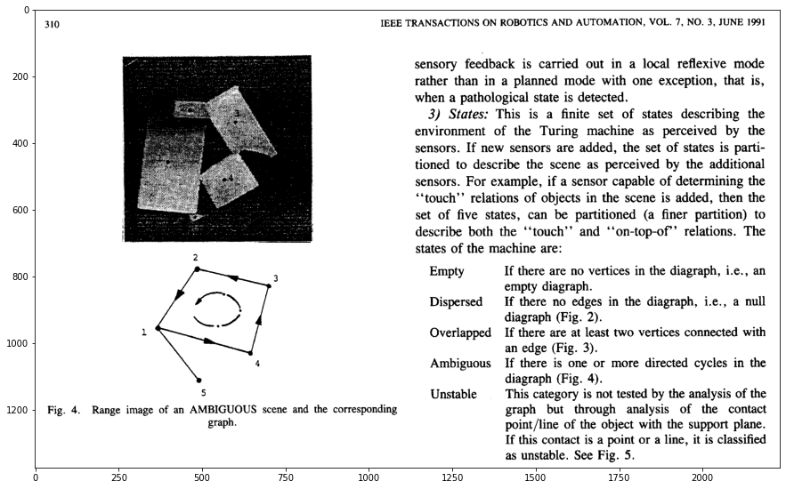

The morphological algorithms assume that the image contains an object with white pixels on a black background, which is the opposite of what we have in the original image.

Applying a morphological operator to this image does not yield the desired result. This can be seen in the example shown in Figure 2, where we applied a dilation operator to the original image and its counterpart with inverted pixel values. The loss of information can be observed when the operator is applied to the original image.

Figure 2 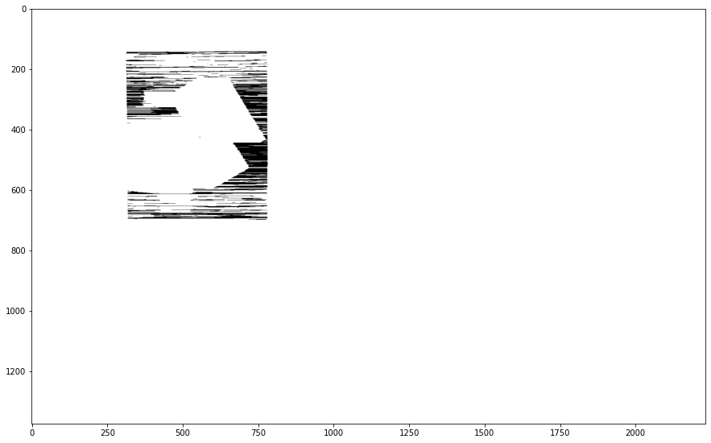

The image with inverted pixel values can be seen in Figure 3.

Figure 3 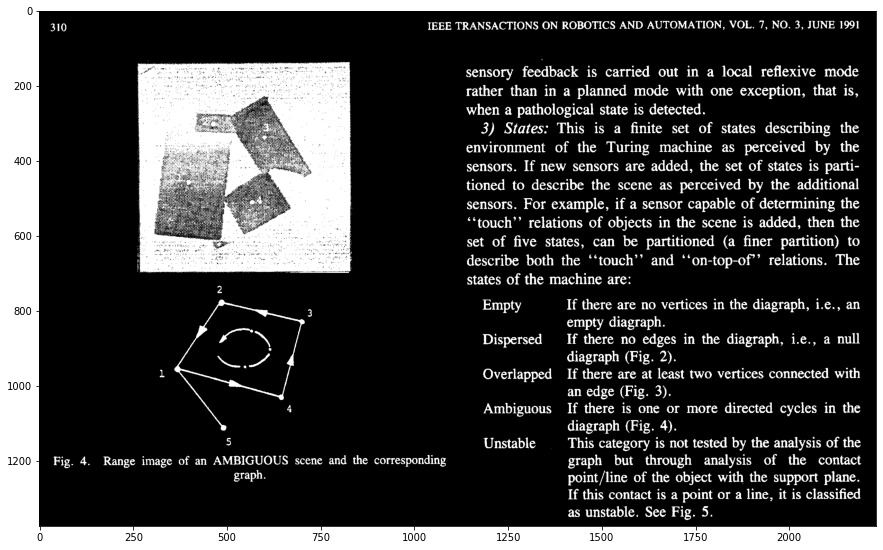

## III - Applying morphological operators

### 1 - Dilation of the original image with a structuring element of 1 pixel in height and 100 pixels in width.

The structuring element, with a height of 1 pixel and a width of 100 pixels, used for dilating the elements of the image, will expand the elements with a value of 255, which represent white, in the horizontal direction. This will particularly affect regions where there is text in the image by highlighting the structure of the arrangement of text objects in their horizontal lines.

The provided code performs image dilation using a structuring element. Here's a breakdown of what each line does:

```python
# Create a horizontal line structuring element (kernel) with 1 row and 100 columns
kernel = np.ones((1, 100))

# Perform image dilation on the original image using the defined kernel
# The resulting dilated image is stored in img_1
img_1 = cv2.dilate(img_original, kernel, iterations=1)

# Create a new figure for plotting the resulting image with a size of 15x15 inches
plt.figure(figsize=(15, 15))

# Display the dilated image using grayscale colormap
plt.imshow(img_1, cmap="gray")

# Show the figure with the dilated image
plt.show()
```
The result of this operation is observed in Figure 4.

Figure 4 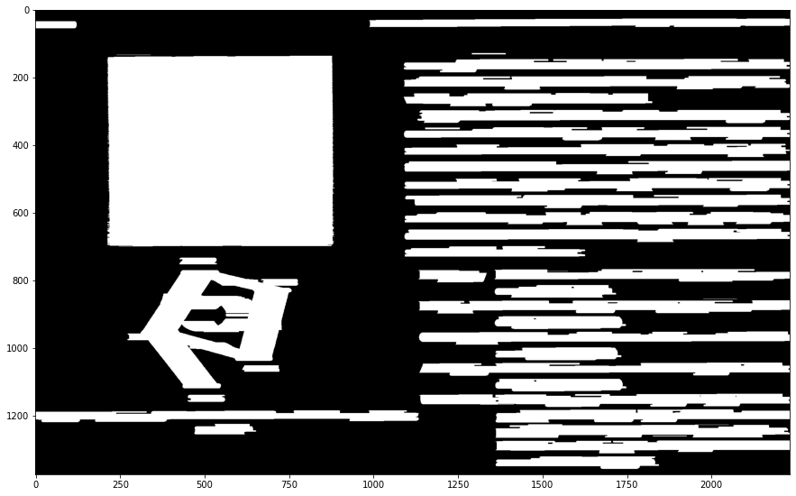

### 2 - Erosion of the resulting image with the same structuring element from the previous step

Applying the erosion operation to an image that has already undergone dilation with the same structuring element is known as the Closing operation. It smoothens the contours of objects in an image, eliminates narrow gaps and small holes, and fills gaps.

The result obtained with our image is a clearer definition of the text lines, with white pixels covering the text regions more accurately, increasing the separation between the text lines.

The provided code performs image erosion using a structuring element.

```python
# Create a horizontal line structuring element (kernel) with 1 row and 100 columns
kernel = np.ones((1, 100))

# Perform image erosion on img_1 using the defined kernel
# The resulting eroded image is stored in img_2
img_2 = cv2.erode(img_1, kernel, iterations=1)

# Create a new figure for plotting the resulting image with a size of 15x15 inches
plt.figure(figsize=(15, 15))

# Display the eroded image using grayscale colormap
plt.imshow(img_2, cmap="gray")

# Show the figure with the eroded image
plt.show()
```
The result can be seen in Figure 5.

Figure 5 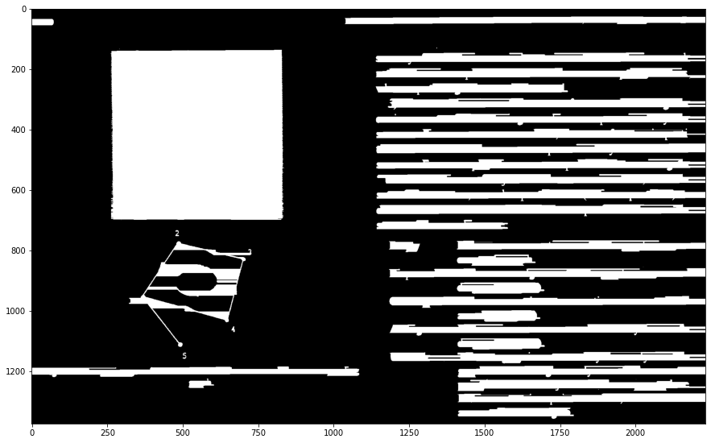

### 3 - Dilation of the original image using a structuring element with a height of 200 pixels and a width of 1 pixel

With a structuring element of dimensions (200, 1), the dilation now has the effect of expanding objects in the vertical direction and highlighting the spaces between these objects, but now horizontally, separating words in the case of text, rather than lines as in previous items. However, since the structuring element has a height of 200 pixels, it ends up dilating the elements vertically and causing the overlap of elements that are below or above, making it difficult to distinguish the separations between the lines and words of the text.

```python
# Dilation
# Create a vertical line structuring element (kernel) with 200 rows and 1 column
kernel = np.ones((200, 1))

# Perform image dilation on img using the defined kernel
# The resulting dilated image is stored in img_3
img_3 = cv2.dilate(img, kernel, iterations=1)

# Create a new figure for plotting the resulting image with a size of 15x15 inches
plt.figure(figsize=(15, 15))

# Display the dilated image using grayscale colormap
plt.imshow(img_3, cmap="gray")

# Show the figure with the dilated image
plt.show()
```

The resulting image from this operation can be seen in Figure 6.

Figure 6 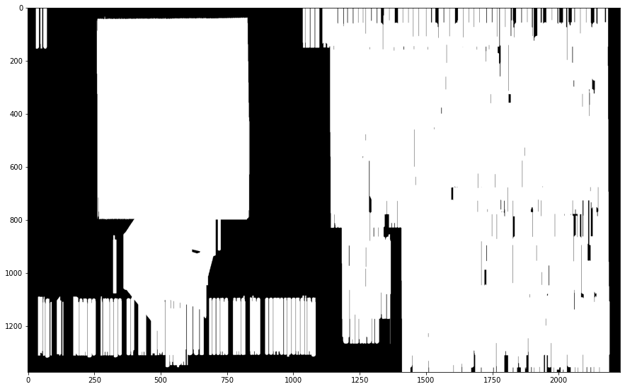

### 4 - Erosion of the resulting image with the same structuring element from the previous step

The dilation operation from the previous step, followed by erosion using the same structuring element with dimensions (200, 1), is equivalent to the Closing operation, which fills narrow gaps and small holes. 

```python
# Erosion
# Create a vertical line structuring element (kernel) with 200 rows and 1 column
kernel = np.ones((200, 1))

# Perform image erosion on img_3 using the defined kernel
# The resulting eroded image is stored in img_4
img_4 = cv2.erode(img_3, kernel, iterations=1)

# Create a new figure for plotting the resulting image with a size of 15x15 inches
plt.figure(figsize=(15, 15))

# Display the eroded image using grayscale colormap
plt.imshow(img_4, cmap="gray")

# Show the figure with the eroded image
plt.show()
```

The result will be an image where the regions of text concentration will be almost entirely filled with white pixels, but now, there is reduction in the rows overlapping, as seen in Figure 7.

Figure 7 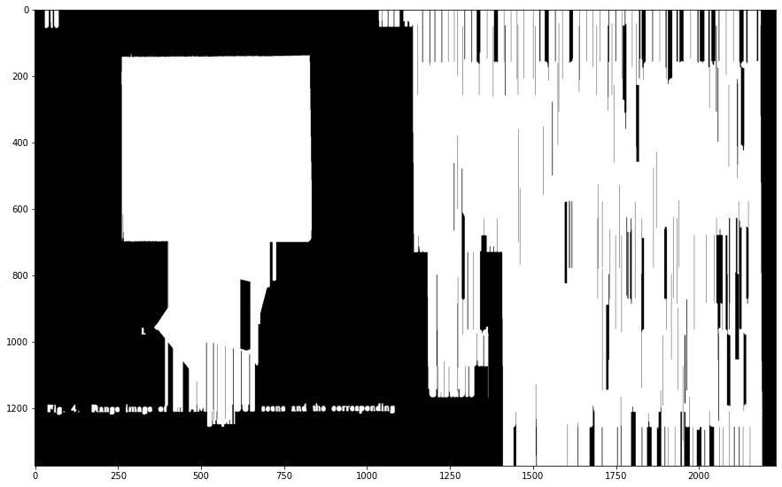

### 5 - Application of the intersection (AND) of the results from steps 2 and 4

The intersection of the results from steps 2 and 4 will result in an image where the vertically closed text block is separated into its text lines.

```python
# Intersection of img_2 and img_4 using bitwise AND operation
img_5 = np.bitwise_and(img_2, img_4)

# Create a new figure for plotting the resulting image with a size of 15x15 inches
plt.figure(figsize=(15, 15))

# Display the resulting image after the intersection using grayscale colormap
plt.imshow(img_5, cmap="gray")

# Show the figure with the resulting image
plt.show()
```

The result of this operation is shown in Figure 8.

Figure 8 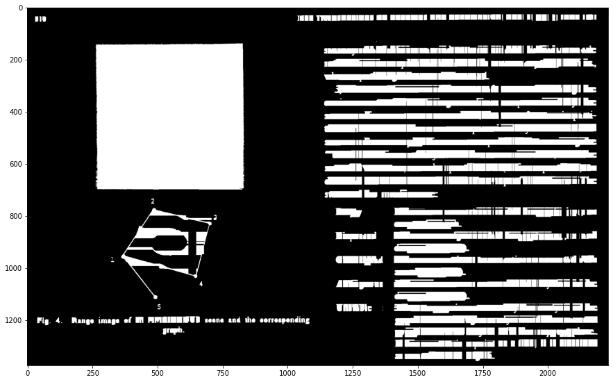

However, text lines such as the one in the bottom left of the image, which do not have any other text lines above or below, did not undergo complete closure, which would require another closing operation in the horizontal direction to make the line a connected component.

### 6 - Closing of the result obtained in step 5 with a structuring element of 1 pixel in height and 30 pixels in width

Closing with the structuring element of dimensions (1, 30) will fill in the spaces between words in lines that are not part of a larger text block. This is the case for the small text block in the upper left corner and the line in the bottom left of the image.

```python
# Closing operation on img_5 using a horizontal line structuring element with 1 row and 30 columns
kernel = np.ones((1, 30))
img_6 = cv2.morphologyEx(img_5, cv2.MORPH_CLOSE, kernel)

# Create a new figure for plotting the resulting image with a size of 15x15 inches
plt.figure(figsize=(15, 15))

# Display the resulting image after the closing operation using grayscale colormap
plt.imshow(img_6, cmap="gray")

# Show the figure with the resulting image
plt.show()
```

The result is shown in Figure 9.

Figure 9 

### 7 - Application of an algorithm for connected component identification on the result of step 6

The goal of this step is to delineate the connected elements in the image as a part of separating the text lines from the image.

For this task, I used the findContours function from the OpenCV package applied to the resulting image from step 2.6. This function returns a NumPy array with the coordinates (x, y) of the pixels that belong to the contour of an object.

With this result, I used the boundingRect function from OpenCV to obtain the coordinates (x, y) of the top-left corner, as well as the width and height of a rectangle that encloses the object whose contour was found with the findContours function.

As a result, all objects segmented by the morphological operators are highlighted by their bounding boxes, including both text-containing and non-text-containing elements.

```python
# Find contours of the image after step 2.6 using external retrieval mode and simple chain approximation
contours = cv2.findContours(img_6, cv2.RETR_EXTERNAL, cv2.CHAIN_APPROX_SIMPLE)
contours = contours[0] if len(contours) == 2 else contours[1]

# Create a copy of the original image to draw bounding boxes on
img_7 = img_original.copy()

# Iterate over each contour found
for cntr in contours:
    pad = 10
    # Extract the coordinates (x, y), width (w), and height (h) of the bounding rectangle
    x, y, w, h = cv2.boundingRect(cntr)
    # Draw a rectangle around the contour with a padding of 10 pixels
    cv2.rectangle(img_7, (x-pad, y-pad), (x+w+pad, y+h+pad), (0, 0, 255), 4)

# Create a new figure for plotting the resulting image with a size of 15x15 inches
plt.figure(figsize=(15, 15))

# Display the image with bounding boxes using grayscale colormap
plt.imshow(img_7, cmap="gray")

# Show the figure with the resulting image
plt.show()
```

The result is shown in Figure 10.

Figure 10 

Several noise elements that are also identified as connected components are observed and marked by small bounding boxes.

### 8 - Find a way to classify the bounding boxes as Text or Non-Text

I will calculate the (a) ratio between the number of black pixels and the total number of pixels for each bounding box and the (b) ratio between the number of vertical and horizontal transitions from white to black and the total number of black pixels.

With those numbers, I will search for a rule to classify the bounding boxes as Text or Non-Text.

 a) Ratio between the number of black pixels and the total number of pixels (height versus width)
- For this calculation, I counted the number of black pixels within each object's bounding rectangle using its position values (x, y) along with its height (h) and width (w).
Some objects were entirely composed of black pixels, resulting in a value of zero for this calculation.

```python
# set a list to receive the black pixels ratio for each bounding box
razao_pixels_pretos = []

# Iterate over each contour found
for cntr in contours:
    # Extract the coordinates (x, y), width (w), and height (h) of the bounding rectangle
    x, y, w, h = cv2.boundingRect(cntr)
    
    # Calculate the number of black pixels within the bounding rectangle
    n_pixels_pretos = np.sum(img[y:y + h, x:x + w]) / 255
    
    # Calculate the total number of pixels within the bounding rectangle
    total_pixels = h * w
    
    # Calculate the ratio between the number of black pixels and the total number of pixels
    razao_pixels_pretos.append(n_pixels_pretos / total_pixels)

# Print the number of calculated ratios
print(len(razao_pixels_pretos))

# Display the calculated ratios
razao_pixels_pretos
```

In total, 52 connected components were found, and the calculated values for each of them were stored in a list. This list can be seen in Figure 11.

Figure 11

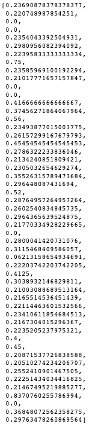

b) Ratio between the number of vertical and horizontal transitions from white to black and the total number of black pixels
- I used the diff function from NumPy to identify transitions from white to black values in a specific region of the image. In this case, I applied this function to each bounding rectangle region and stored the results in a list, shown in Figure 12.

```python
# set two lists to receive vertical and horizontal transitions values
transicao_vert = []
transicao_hor = []

# Iterate over each contour found
for cntr in contours:
    # Extract the coordinates (x, y), width (w), and height (h) of the bounding rectangle
    x, y, w, h = cv2.boundingRect(cntr)
    
    # Calculate the number of black pixels within the bounding rectangle
    n_pixels_pretos = np.sum(img[y:y + h, x:x + w]) / 255
    
    if n_pixels_pretos != 0:
        # Count the number of vertical transitions from white to black within the region
        transicao_vert.append(np.count_nonzero(np.diff(img_original[y:y + h, x:x + w] / 255, axis=0)))
        
        # Count the number of horizontal transitions from white to black within the region
        transicao_hor.append(np.count_nonzero(np.diff(img_original[y:y + h, x:x + w] / 255, axis=-1)))
    else:
        transicao_vert.append(0)
        transicao_hor.append(0)

# Calculate the ratio between the sum of vertical and horizontal transitions and the number of black pixels
razao_transicoes_pxlpretos = ((np.array(transicao_vert) + np.array(transicao_hor)) / n_pixels_pretos).tolist()

# Print the number of calculated ratios
print(len(razao_transicoes_pxlpretos))

# Display the calculated ratios
razao_transicoes_pxlpretos
```

Figure 12

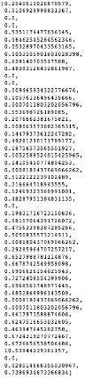

Observing the values of items (a) and (b) above, I arrived at a rule to determine whether a connected component would be text or non-text.

The rule is described as follows:

- Ratio of black pixels to total pixels > 0.07

- 1 > Ratio of transitions from white to black to total black pixels > 0.001

Applying this rule, I was able to classify the connected components as text or non-text with a high level of accuracy, except for two cases where the number 1 and number 3 ended up being part of the connected component of the second graphical element in the image.

```python
# set a counter variable
count = 0
# set a list to receive each connected component classification
classificacao = []
# copy the original image
img_9 = img_original.copy()

# Iterate over each contour found
for cntr in contours:
    # Extract the coordinates (x, y), width (w), and height (h) of the bounding rectangle
    x, y, w, h = cv2.boundingRect(cntr)
    n_pixels = (h) * (w)
    
    if razao_pixels_pretos[count] != 0 \
            and razao_pixels_pretos[count] > 0.07 \
            and razao_transicoes_pxlpretos[count] > 0.001 \
            and razao_transicoes_pxlpretos[count] < 1:
        # If the connected component meets the classification criteria, append 1 to the classification list
        classificacao.append(1)

        # Draw a rectangle around the connected component with a padding of 10 pixels
        pad = 10
        x, y, w, h = cv2.boundingRect(cntr)
        cv2.rectangle(img_9, (x-pad, y-pad), (x+w+pad, y+h+pad), (0, 0, 255), 4)
    else:
        # If the connected component does not meet the classification criteria, append 0 to the classification list
        classificacao.append(0)

    count = count + 1
```

My script was able to count 39 Text lines in the original image.

Some of these connected components are shown in Figure 13.

Figure 13

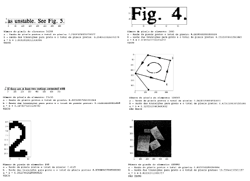

The result of segmenting the elements into text and non-text for the entire image is presented in Figure 14.

Figure 14


### 9 - Application of appropriate morphological operators to segment each line of text into word blocks

Now I am going to use the same structuring element as in steps 1 and 2, (1, 100), for the horizontal closing operation of the text lines. Figures 4 and 5 serve as a reference for the result of this operation involving image dilation and erosion with the same structuring element.

Then I will apply closing in the vertical direction, but with a smaller structuring element in an attempt to make each word become a connected component. The dimensions of the structuring element in this operation will be (30, 1). The closing operation here will be performed by dilation and erosion with the same structuring element.

```python
# Horizontal closing operation

# Horizontal dilation
# Create a structuring element with dimensions (1, 100)
kernel = np.ones((1, 100))
# Dilate the image 'img' using the defined structuring element
img_10 = cv2.dilate(img, kernel, iterations=1)

# Horizontal erosion
# Erode the dilated image 'img_10' using the defined structuring element
img_11 = cv2.erode(img_10, kernel, iterations=1)
```

```python
# Vertical closing operation

# Vertical dilation
# Create a structuring element with dimensions (30, 1)
kernel = np.ones((30, 1))
# Dilate the image 'img' using the defined structuring element
img_12 = cv2.dilate(img, kernel, iterations=1)

# Vertical erosion
# Erode the dilated image 'img_12' using the same structuring element
img_13 = cv2.erode(img_12, kernel, iterations=1)
```

The next step will be to intersect the results of the horizontal and vertical closings in such a way that the word blocks are spaced between lines and between words, and closer in relation to the letters of each word. With this, a closing operation with an appropriate structuring element can make each word an individual connected component separated from the other words. The result of this is shown in the Figure 15.

```python
# Perform bitwise AND operation (intersection) between the images 'img_11' and 'img_13'
img_14 = np.bitwise_and(img_11, img_13)

# Create a figure with a size of 15x15 inches
plt.figure(figsize=(15, 15))

# Display the image 'img_14'
plt.imshow(img_14, cmap="gray")

# Show the plot
plt.show()
```

Figure 15

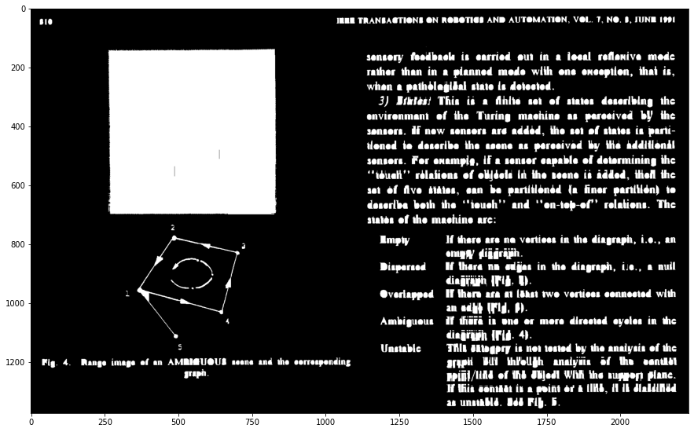

The next step is to perform a closing operation to turn the words in the image into connected components.
After testing some values, I defined the structuring element as having dimensions (8, 12) for the closing to be applied to the intersection image of horizontal and vertical closings. With these dimensions, the letters of the words will be connected, forming connected components at the word level. The result of this operation is presented in Figure 16.

```python
# Create a structuring element with dimensions (8, 12)
kernel = np.ones((8, 12))

# Perform morphological closing on the image 'img_14' using the defined structuring element
img_15 = cv2.morphologyEx(img_14, cv2.MORPH_CLOSE, kernel)

# Create a figure with a size of 15x15 inches
plt.figure(figsize=(15, 15))

# Display the resulting image after morphological closing
plt.imshow(img_15, cmap="gray")

# Show the plot
plt.show()
```

Figure 16

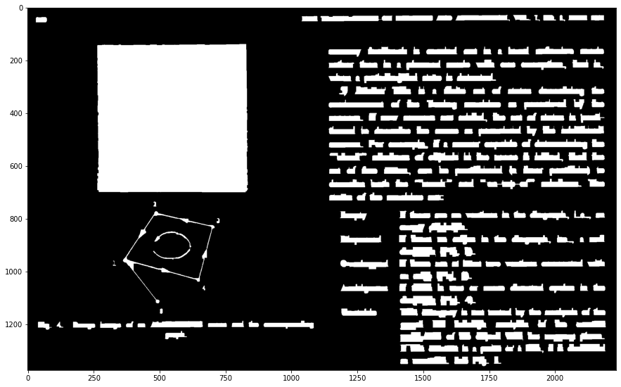

The next step is to classify each of the connected components as Text and Non-Text components. I will use the same metrics and criteria I have used previously in items 8 and 9.

```python
# Find contours in the image 'img_15' using the external retrieval mode and simple chain approximation
contours = cv2.findContours(img_15, cv2.RETR_EXTERNAL, cv2.CHAIN_APPROX_SIMPLE)

# If the OpenCV version is older (returns 3 values), select the second value as contours
contours = contours[0] if len(contours) == 2 else contours[1]

# Create a copy of the original image 'img_original'
img_16 = img_original.copy()

# Iterate over each contour
for cntr in contours:
    # Get the bounding box coordinates of the contour
    pad = 10
    x, y, w, h = cv2.boundingRect(cntr)
    
    # Draw a rectangle around the bounding box
    cv2.rectangle(img_16, (x - pad, y - pad), (x + w + pad, y + h + pad), (0, 0, 255), 4)


# List to store the ratio of black pixels
razao_pixels_pretos = []

# Iterate over each contour
for cntr in contours:
    x, y, w, h = cv2.boundingRect(cntr)
    
    # Count the number of black pixels within the contour's bounding box
    n_pixels_pretos = np.sum(img[y:y + h, x:x + w]) / 255
    
    # Calculate the total number of pixels within the bounding box
    total_pixels = h * w
    
    # Compute the ratio of black pixels to total pixels
    razao_pixels_pretos.append(n_pixels_pretos / total_pixels)

# Lists to store the transition ratios and total number of black pixels for each contour
transicao_vert = []
transicao_hor = []

# Iterate over each contour again
for cntr in contours:
    x, y, w, h = cv2.boundingRect(cntr)
    
    # Count the number of black pixels within the contour's bounding box
    n_pixels_pretos = np.sum(img[y:y + h, x:x + w]) / 255
    
    if n_pixels_pretos != 0:
        # Compute the number of transitions from white to black vertically and horizontally
        transicao_vert.append(np.count_nonzero(np.diff(img_original[y:y + h, x:x + w] / 255, axis=0)))
        transicao_hor.append(np.count_nonzero(np.diff(img_original[y:y + h, x:x + w] / 255, axis=-1)))
    else:
        transicao_vert.append(0)
        transicao_hor.append(0)

# Compute the ratio of transitions to the number of black pixels
razao_transicoes_pxlpretos = ((np.array(transicao_vert) + np.array(transicao_hor)) / n_pixels_pretos).tolist()

# Classification based on defined criteria
count = 0
classificacao = []
img_17 = img_original.copy()

for cntr in contours:
    x, y, w, h = cv2.boundingRect(cntr)
    n_pixels = (h) * (w)
    if razao_pixels_pretos[count] != 0 \
            and razao_pixels_pretos[count] > 0.06 \
            and razao_transicoes_pxlpretos[count] > 0.001 \
            and razao_transicoes_pxlpretos[count] < 1:
        classificacao.append(1)
        # Draw rectangles around classified text elements
        pad = 10
        cv2.rectangle(img_17, (x - pad, y - pad), (x + w + pad, y + h + pad), (0, 0, 255), 4)
    else:
        classificacao.append(0)
    count = count + 1

# Display the result
print('Número de palavras:', sum(classificacao))
plt.figure(figsize=(15, 15))
plt.imshow(img_17, cmap="gray")
plt.show()
```

I was able to identify 240 words, including numbers, in the image. The Figure 17 shows each identified word with bounding boxes.

Figure 17

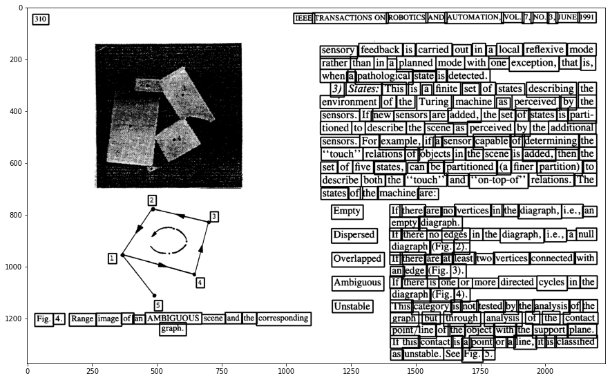


## Conclusion


Morphological operators have proven to be powerful and efficient when the appropriate structuring elements are defined with sufficient time and effort. However, the segmentations were not entirely accurate as some small text blocks were not properly segmented, such as the numbers 1 and 3 near the bottom part of the image when searching for text lines. However, these blocks were correctly identified when the goal was to identify individual word blocks within the image.

Another issue encountered, which would require further work, is that words containing quotation marks or located near punctuation marks such as periods and dashes had these marks identified as part of the words. Further exploration or the application of other techniques may yield more precise separation results in terms of differentiating between words and punctuation marks, for example.