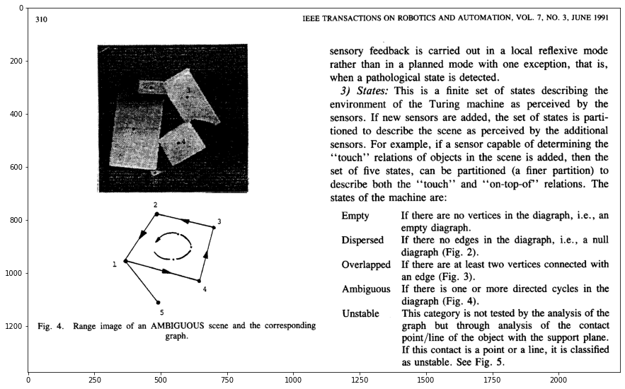
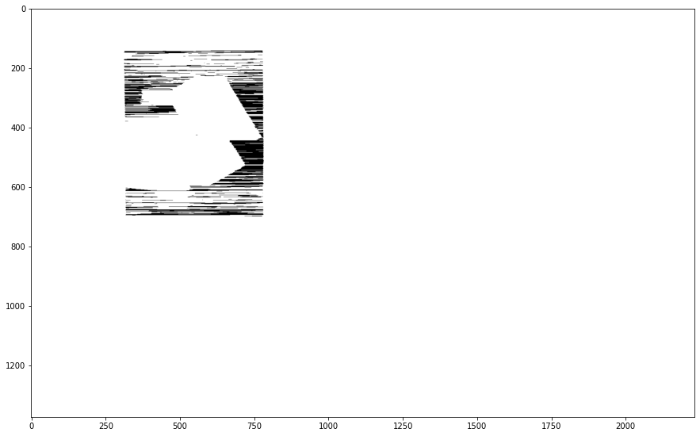
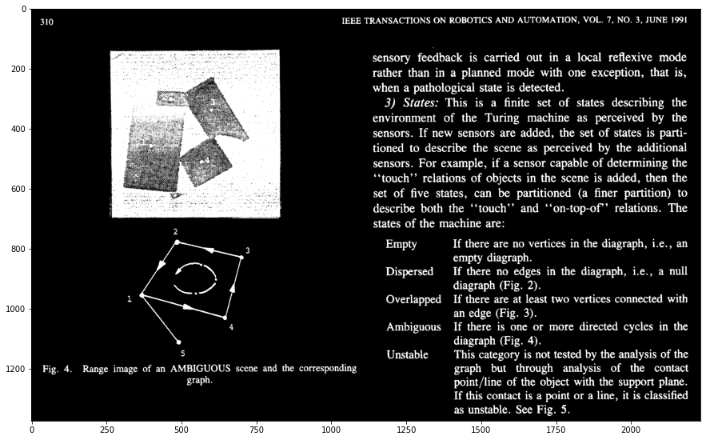
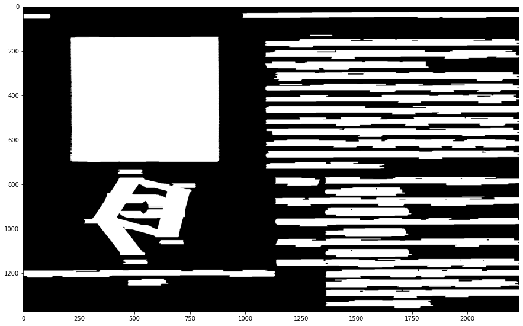
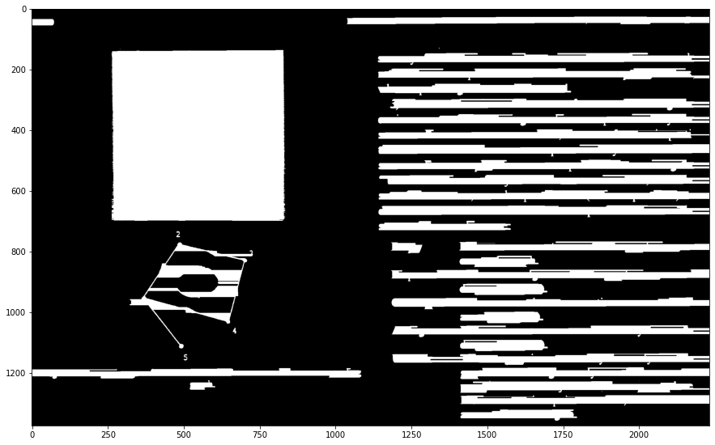
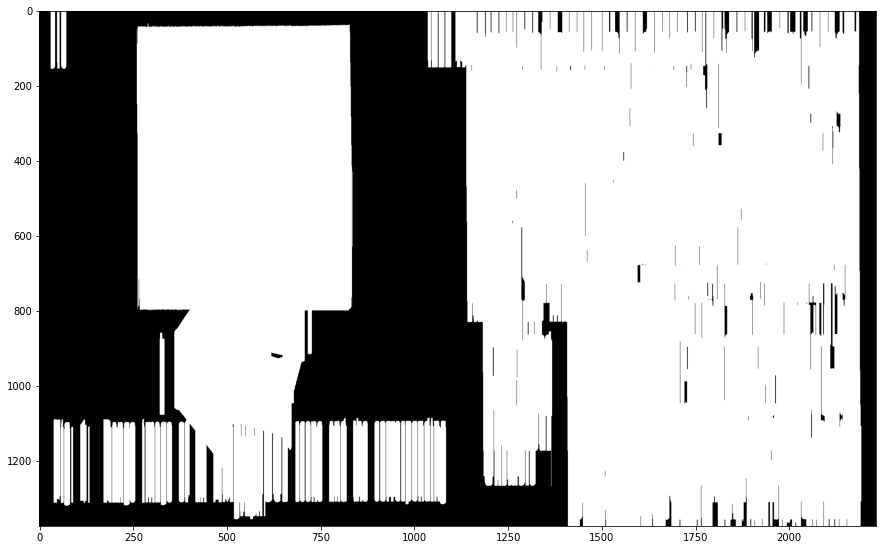
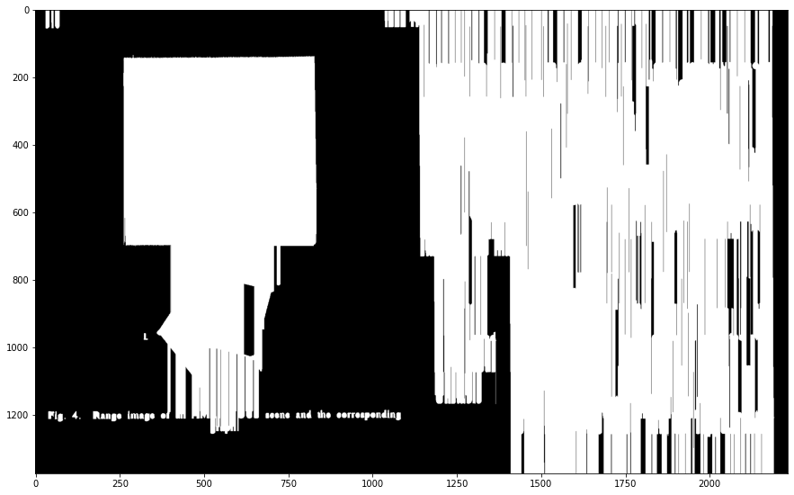
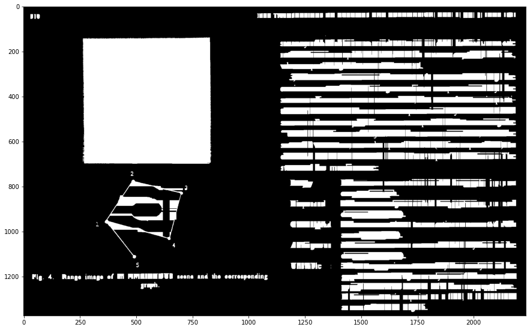
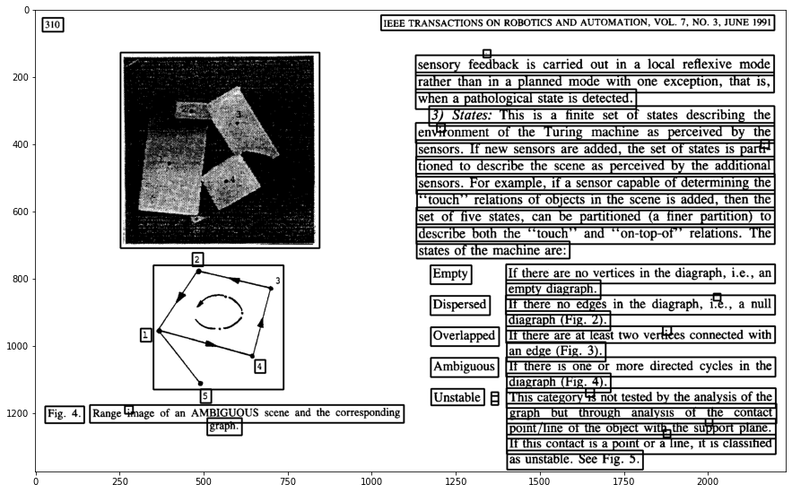

# Digital Image Processing
---
## Studying Morphological Operations
#### Author: Maurício Pereira Lopes
---

## I - Introduction
The objective of the work is to apply morphological operators to segment regions comprising text and non-text in an input image.

I have implemented the morphological operations by developing a set of Python scripts using OpenCV functions.

The final goal is to segment and count words, and separate them from non-text objects within the image.

My scripts are dependent on the Python packages below:

-  imageio: provides an interface for reading and writing image data.
- matplotlib.pyplot: creation of plots and visualizations, including image data.
- numpy: array manipulation.
- cv2: OpenCV library for image processing and manipulation.

## II - Pre-processing
The image is a file in PBM format containing regions with text and regions with non-text graphic objects.

It is a binary image with dimensions of 1374 rows by 2233 columns, with white pixels having a value of 255 and black pixels having a value of 0.
The original image is shown in Figure 1.

Figure 1

The morphological algorithms assume that the image contains an object with white pixels on a black background, which is the opposite of what we have in the original image.

Applying a morphological operator to this image does not yield the desired result. This can be seen in the example shown in Figure 2, where we applied a dilation operator to the original image and its counterpart with inverted pixel values. The loss of information can be observed when the operator is applied to the original image.

Figure 2 

The image with inverted pixel values can be seen in Figure 3.

Figure 3 

## III - Applying morphological operators

### 1 - Dilation of the original image with a structuring element of 1 pixel in height and 100 pixels in width.

The structuring element, with a height of 1 pixel and a width of 100 pixels, used for dilating the elements of the image, will expand the elements with a value of 255, which represent white, in the horizontal direction. This will particularly affect regions where there is text in the image by highlighting the structure of the arrangement of text objects in their horizontal lines.

The provided code performs image dilation using a structuring element. Here's a breakdown of what each line does:

```python
# Create a horizontal line structuring element (kernel) with 1 row and 100 columns
kernel = np.ones((1, 100))

# Perform image dilation on the original image using the defined kernel
# The resulting dilated image is stored in img_1
img_1 = cv2.dilate(img_original, kernel, iterations=1)

# Create a new figure for plotting the resulting image with a size of 15x15 inches
plt.figure(figsize=(15, 15))

# Display the dilated image using grayscale colormap
plt.imshow(img_1, cmap="gray")

# Show the figure with the dilated image
plt.show()
```
The result of this operation is observed in Figure 4.

Figure 4 

### 2 - Erosion of the resulting image with the same structuring element from the previous step

Applying the erosion operation to an image that has already undergone dilation with the same structuring element is known as the Closing operation. It smoothens the contours of objects in an image, eliminates narrow gaps and small holes, and fills gaps.

The result obtained with our image is a clearer definition of the text lines, with white pixels covering the text regions more accurately, increasing the separation between the text lines.

The provided code performs image erosion using a structuring element.

```python
# Create a horizontal line structuring element (kernel) with 1 row and 100 columns
kernel = np.ones((1, 100))

# Perform image erosion on img_1 using the defined kernel
# The resulting eroded image is stored in img_2
img_2 = cv2.erode(img_1, kernel, iterations=1)

# Create a new figure for plotting the resulting image with a size of 15x15 inches
plt.figure(figsize=(15, 15))

# Display the eroded image using grayscale colormap
plt.imshow(img_2, cmap="gray")

# Show the figure with the eroded image
plt.show()
```
The result can be seen in Figure 5.

Figure 5 

### 3 - Dilation of the original image using a structuring element with a height of 200 pixels and a width of 1 pixel

With a structuring element of dimensions (200, 1), the dilation now has the effect of expanding objects in the vertical direction and highlighting the spaces between these objects, but now horizontally, separating words in the case of text, rather than lines as in previous items. However, since the structuring element has a height of 200 pixels, it ends up dilating the elements vertically and causing the overlap of elements that are below or above, making it difficult to distinguish the separations between the lines and words of the text.

```python
# Dilation
# Create a vertical line structuring element (kernel) with 200 rows and 1 column
kernel = np.ones((200, 1))

# Perform image dilation on img using the defined kernel
# The resulting dilated image is stored in img_3
img_3 = cv2.dilate(img, kernel, iterations=1)

# Create a new figure for plotting the resulting image with a size of 15x15 inches
plt.figure(figsize=(15, 15))

# Display the dilated image using grayscale colormap
plt.imshow(img_3, cmap="gray")

# Show the figure with the dilated image
plt.show()
```

The resulting image from this operation can be seen in Figure 6.

Figure 6 

### 4 - Erosion of the resulting image with the same structuring element from the previous step

The dilation operation from the previous step, followed by erosion using the same structuring element with dimensions (200, 1), is equivalent to the Closing operation, which fills narrow gaps and small holes. 

```python
# Erosion
# Create a vertical line structuring element (kernel) with 200 rows and 1 column
kernel = np.ones((200, 1))

# Perform image erosion on img_3 using the defined kernel
# The resulting eroded image is stored in img_4
img_4 = cv2.erode(img_3, kernel, iterations=1)

# Create a new figure for plotting the resulting image with a size of 15x15 inches
plt.figure(figsize=(15, 15))

# Display the eroded image using grayscale colormap
plt.imshow(img_4, cmap="gray")

# Show the figure with the eroded image
plt.show()
```

The result will be an image where the regions of text concentration will be almost entirely filled with white pixels, but now, there is reduction in the rows overlapping, as seen in Figure 7.

Figure 7 

### 5 - Application of the intersection (AND) of the results from steps 2 and 4

The intersection of the results from steps 2 and 4 will result in an image where the vertically closed text block is separated into its text lines.

```python
# Intersection of img_2 and img_4 using bitwise AND operation
img_5 = np.bitwise_and(img_2, img_4)

# Create a new figure for plotting the resulting image with a size of 15x15 inches
plt.figure(figsize=(15, 15))

# Display the resulting image after the intersection using grayscale colormap
plt.imshow(img_5, cmap="gray")

# Show the figure with the resulting image
plt.show()
```

The result of this operation is shown in Figure 8.

Figure 8 

However, text lines such as the one in the bottom left of the image, which do not have any other text lines above or below, did not undergo complete closure, which would require another closing operation in the horizontal direction to make the line a connected component.

### 6 - Closing of the result obtained in step 5 with a structuring element of 1 pixel in height and 30 pixels in width

Closing with the structuring element of dimensions (1, 30) will fill in the spaces between words in lines that are not part of a larger text block. This is the case for the small text block in the upper left corner and the line in the bottom left of the image.

```python
# Closing operation on img_5 using a horizontal line structuring element with 1 row and 30 columns
kernel = np.ones((1, 30))
img_6 = cv2.morphologyEx(img_5, cv2.MORPH_CLOSE, kernel)

# Create a new figure for plotting the resulting image with a size of 15x15 inches
plt.figure(figsize=(15, 15))

# Display the resulting image after the closing operation using grayscale colormap
plt.imshow(img_6, cmap="gray")

# Show the figure with the resulting image
plt.show()
```

The result is shown in Figure 9.

Figure 9 

### 7 - Application of an algorithm for connected component identification on the result of step 6

The goal of this step is to delineate the connected elements in the image as a part of separating the text lines from the image.

For this task, I used the findContours function from the OpenCV package applied to the resulting image from step 2.6. This function returns a NumPy array with the coordinates (x, y) of the pixels that belong to the contour of an object.

With this result, I used the boundingRect function from OpenCV to obtain the coordinates (x, y) of the top-left corner, as well as the width and height of a rectangle that encloses the object whose contour was found with the findContours function.

As a result, all objects segmented by the morphological operators are highlighted by their bounding boxes, including both text-containing and non-text-containing elements.

```python
# Find contours of the image after step 2.6 using external retrieval mode and simple chain approximation
contours = cv2.findContours(img_6, cv2.RETR_EXTERNAL, cv2.CHAIN_APPROX_SIMPLE)
contours = contours[0] if len(contours) == 2 else contours[1]

# Create a copy of the original image to draw bounding boxes on
img_7 = img_original.copy()

# Iterate over each contour found
for cntr in contours:
    pad = 10
    # Extract the coordinates (x, y), width (w), and height (h) of the bounding rectangle
    x, y, w, h = cv2.boundingRect(cntr)
    # Draw a rectangle around the contour with a padding of 10 pixels
    cv2.rectangle(img_7, (x-pad, y-pad), (x+w+pad, y+h+pad), (0, 0, 255), 4)

# Create a new figure for plotting the resulting image with a size of 15x15 inches
plt.figure(figsize=(15, 15))

# Display the image with bounding boxes using grayscale colormap
plt.imshow(img_7, cmap="gray")

# Show the figure with the resulting image
plt.show()
```

The result is shown in Figure 10.

Figure 10 

Several noise elements that are also identified as connected components are observed and marked by small bounding boxes.

